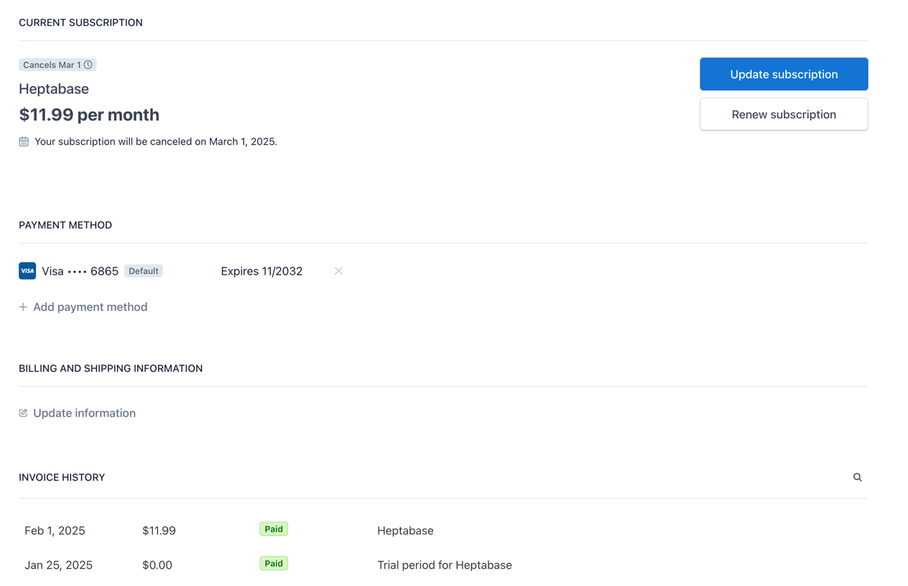

# Accept a Payment with Stripe Checkout

Stripe Checkout is the fastest way to get started with payments.

## Blueprint

1. 进入 billing page(own site) 能看到 plan list ❌
2. 能够选中一个~~/多个~~进行订阅 ❌
3. 点击订阅跳转到「支付界面」✅
4. 支付界面能使用各种支付方式，填写 billing address 等信息 ✅
5. 订阅的时候可以选择「保存支付方式」（~~现在我们是「强制执行」的，用户不可以选择~~） 差 webhook set default method
6. 订阅成功之后，返回 billing page
   - 展示默认支付方式
   - 展示订阅信息，并可以「更新订阅信息」
7. 更新订阅的时候可以默认在 checkout 重复使用之前保存的支付方式 ✅
8. 订阅时，可以在 checkout 添加折扣

## Stripe table
```
| **特性** | **Checkout** | **Customer Portal** |
| --- | --- | --- |
| **核心用途** | 前端支付流程（新订单/订阅） | 后端账户管理（已有客户） |
| **交互模式** | 支付表单（收集新支付信息） | 管理面板（修改现有信息） |
| **数据依赖** | 必须包含商品/价格 (`line_items`) | 无需交易数据 |
| **典型场景** | - 新订阅购买- 单次付款 | - 更换信用卡- 取消订阅 |
| **合规要求** | PCI DSS SAQ A | PCI DSS Level 1 |
```

## Features
- display price list ✅
- select price & checkout price ✅
- support multi-price selection (just line item array) ✅
- supported payment method:
  - credit card ✅
  - link        ✅
  - ach debit   ✅
- support save payment method
  - only credit card
  - bank (why the bank payment cannot be saved?)
- support only update payment method, no subscription
- support discount

- upgrade or downgrade subscription use saved payment method ❌ (bank account cannot be saved unless using link)


## Set Price ID

In the back end code, replace `{{PRICE_ID}}` with a Price ID (`price_xxx`) that you created.

## Running the sample

1. Build the server

~~~
composer install
~~~

2. Run the server

~~~
php -S 127.0.0.1:4242 --docroot=public
~~~

3. Build the client app

~~~
npm install
~~~

4. Run the client app

~~~
npm start
~~~

5. Go to [http://localhost:3000/checkout](http://localhost:3000/checkout)
